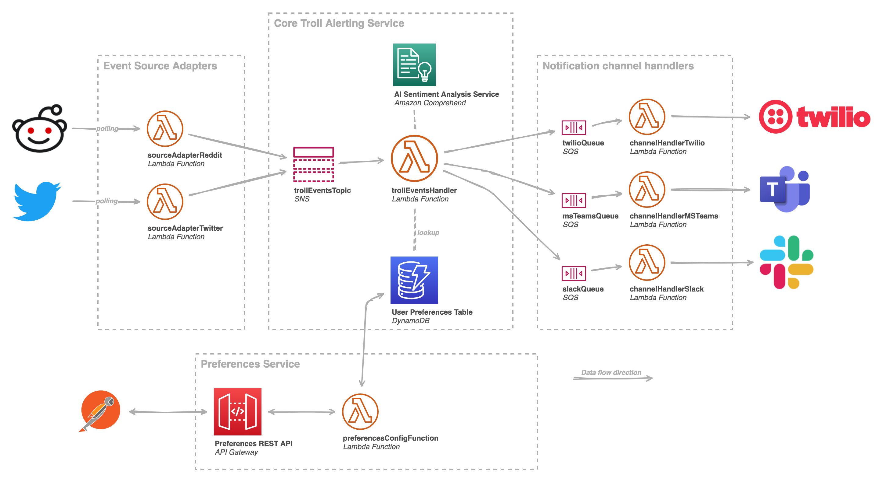
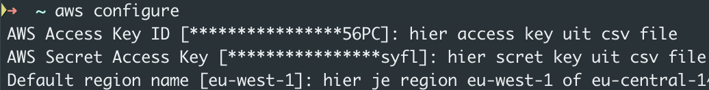
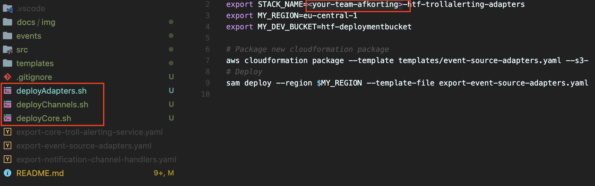
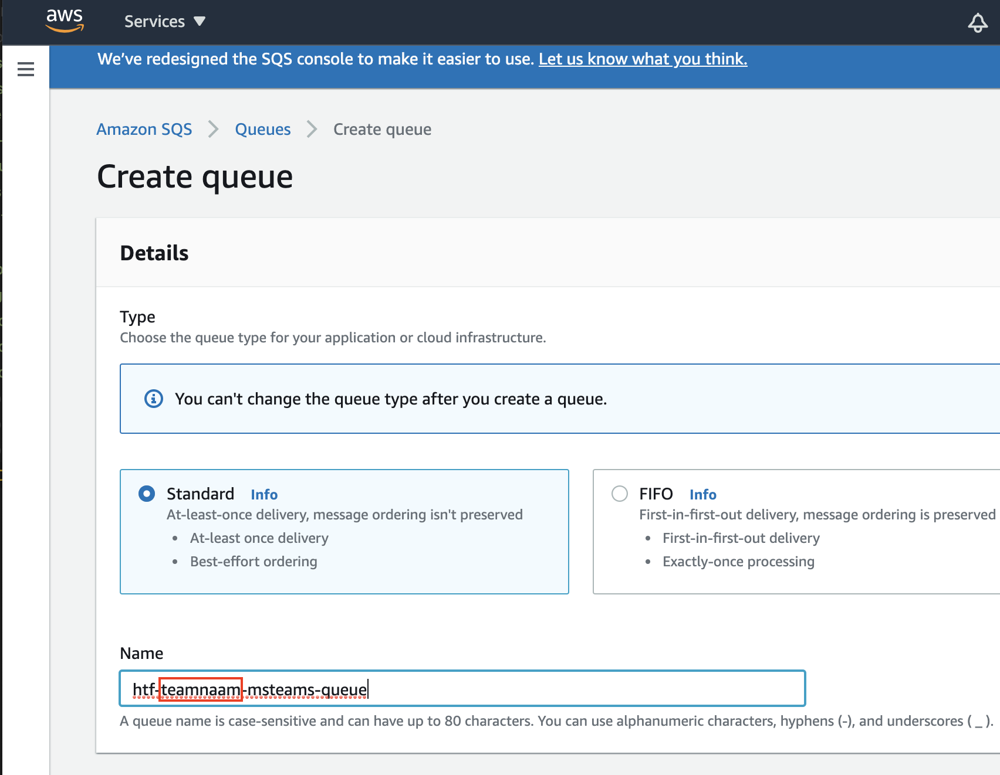

# htf-alerting-service



## Environment setup

1. install AWS cli
https://docs.aws.amazon.com/cli/latest/userguide/install-cliv2.html

2. install AWS SAM CLI (including docker)
https://docs.aws.amazon.com/serverless-application-model/latest/developerguide/serverless-sam-cli-install.html

3. install nodejs version 12 + npm

```bash
# setup aws connection
aws configure
```



## Getting started

1. Adjust deploy scripts


2. Create your teams eventbridge tenant


3. Create one of your teams SQS queue

All default are ok, when created note down both url and arn

4. Create your teams nosql database


## Local development

```bash

# install existing depedencies
cd src/fn-sourceAdapterReddit/
npm install

# Execute function locally, optional add  --skip-pull-image 
sam local invoke FnTrollEventHandler --event ./events/trollEvent.json -t templates/core-troll-alerting-service.yaml

sam local invoke FnSourceAdapterReddit --event ./events/testEvents.json -t templates/event-source-adapters.yaml

sam local invoke FnChannelHandlerMSTeams --event ./events/msTeamsEvent.json -t templates/notification-channel-handlers.yaml --skip-pull-image

# Adding new npm dependencies to function
npm install --save snoowrap

# creating new function
cd src/
mkdir fn-xxxx
cd fn-xxxx
npm init #All defaults are ok

```

## Deploy function to cloud

```bash
# see inside script for more info
bash deployAdapters.sh

bash deployChannels.sh

bash deployCore.sh

```

## Documentation

### AWS Javascript development
* https://docs.aws.amazon.com/AWSJavaScriptSDK/latest/
* https://docs.aws.amazon.com/sdk-for-javascript/v2/developer-guide/sqs-examples-send-receive-messages.html

### Cloudformation and SAM templates
* https://docs.aws.amazon.com/serverless-application-model/latest/developerguide/sam-resource-function.html#sam-function-timeout

### reddit adapter
* https://browntreelabs.com/scraping-reddits-api-with-snoowrap/
* https://www.reddit.com/prefs/apps
* https://github.com/not-an-aardvark/snoowrap
* https://not-an-aardvark.github.io/reddit-oauth-helper/
* https://not-an-aardvark.github.io/snoowrap/Subreddit.html#getTop__anchor

## Usefull commands

```bash
aws configure list
export AWS_PROFILE=yourprofile
```
